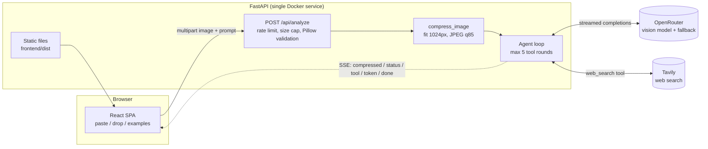

# vis-fix web

Paste a screenshot of an error, get a diagnosis and a fix.

This is the web version of the [vis-fix CLI](../vis-fix). Same pipeline: compress the screenshot, send it to a vision model through OpenRouter, let the model call a web search tool when it needs current docs, stream the answer back. What's different is that it runs as a FastAPI service with a React front end, and the agent loop handles more than one tool call.

> Demo GIF goes here. Worth recording: paste a screenshot, watch the trace fill in, copy the fix.

## Why bother rewriting it

The CLI had two problems.

It only processed the first tool call the model asked for. If the model wanted two searches before answering (which it often does when there's a version number involved), the second one never happened and the answer came back half-researched.

The other problem was the 20 second wait with nothing on screen. That reads as broken even when it isn't.

Both are fixed. The loop keeps executing tool calls until the model stops asking, capped at 5 rounds. Everything streams: compression stats first, then each search query as it fires, then the answer token by token.

## What you get

* Paste from the clipboard, drag and drop, or click one of three bundled example errors. Paste matters most, since that's how you actually take a screenshot.
* Press analyze and the page moves you to the result: a progress bar carries the wait while the model thinks, each step appears as it happens, and the answer streams in when it is ready.
* A trace of what the agent actually did, with real measured durations per step, kept below the answer so it informs without getting in the way.
* Markdown rendering as the answer streams, with syntax highlighted code blocks and copy buttons.
* Per IP rate limiting (5 requests per 15 minutes), a 5 MB upload cap, image validation at the byte level with a 40 megapixel ceiling, and server side downscaling to 1024px.
* Nothing is written to disk. The screenshot is processed in memory and sent once to the model.

## Architecture



The endpoint checks the upload size, then hands the bytes to Pillow to confirm it's actually an image (the Content-Type header is not trusted). It compresses, then returns a `text/event-stream`.

Inside the loop, every model call runs with `stream=true`. Content deltas go straight to the browser as `token` events. Tool call deltas arrive fragmented and keyed by index, so they get reassembled before anything executes. When the model asks for `web_search`, the query is sent to the UI as a `tool` event, run against Tavily, and appended as a `tool` message for the next round. After 5 rounds a final call goes out with `tool_choice="none"` so you always get an answer instead of a dangling tool request.

## Layout

```
vis-fix-web/
├── backend/
│   ├── app/
│   │   ├── main.py            # /api/analyze, rate limiting, static hosting
│   │   ├── agent.py           # the streaming agent loop
│   │   ├── image_processor.py # 1024px / JPEG compression
│   │   ├── tools.py           # web_search schema + Tavily call
│   │   ├── system_prompt.py   # unchanged from the CLI
│   │   └── settings.py        # env config, validated at boot
│   └── tests/e2e_check.py     # full pipeline test against a mock OpenRouter
├── frontend/                  # Vite + React + Tailwind
├── scripts/make_examples.py   # regenerates the bundled example screenshots
├── DESIGN.md                  # design system, read before touching UI
├── Dockerfile
└── render.yaml
```

UI changes go through [DESIGN.md](DESIGN.md). It documents the token system, the one animation that's allowed, and the patterns that are banned on purpose.

## Running it locally

```bash
cd vis-fix-web/backend
python -m venv .venv && .venv/Scripts/activate   # linux/mac: source .venv/bin/activate
pip install -r requirements.txt
cp ../.env.example .env                          # add real keys
uvicorn app.main:app --reload --port 8000
```

Front end in a second terminal. The dev server proxies `/api` to port 8000:

```bash
cd vis-fix-web/frontend
npm install
npm run dev
```

That gives you http://localhost:5173. To see it the way it ships, run `npm run build` and open http://localhost:8000 instead, since FastAPI serves `frontend/dist` directly.

### Testing without spending credits

```bash
cd backend
.venv/Scripts/python tests/e2e_check.py
```

This starts a mock OpenRouter locally and asserts the whole pipeline: SSE event ordering, two chained tool rounds, tool results being fed back to the model, image downscaling, the 413/415 rejections, and the 429 rate limit. It does not touch the real API.

## Deploying

Free tier on Render:

1. Push this folder to GitHub with `render.yaml` and `Dockerfile` at the root.
2. On render.com pick New > Blueprint and select the repo. It reads `render.yaml` and builds the Dockerfile.
3. Set the environment variables when prompted. They're marked `sync: false` so they never end up in git.
4. Deploy. The health check is `/api/health`, and the app refuses to boot without `OPENROUTER_API_KEY`, so a missing key fails the deploy instead of the first request.

| Variable | Required | What it's for |
|---|---|---|
| `OPENROUTER_API_KEY` | yes | model access, https://openrouter.ai/keys |
| `TAVILY_API_KEY` | no | web search. Without it the agent answers from model knowledge and says so |
| `VISFIX_MODEL` | no | primary model, must accept images. Defaults to `google/gemma-4-26b-a4b-it:free` |
| `VISFIX_FALLBACK_MODEL` | no | tried when the primary errors or is rate limited. Defaults to `nvidia/nemotron-nano-12b-v2-vl:free` |
| `VISFIX_RATE_LIMIT` | no | defaults to `5/15 minutes` |

Both model defaults are free and vision-capable, picked from two different providers so the free-tier rate limit on one does not take the app down. Free model slugs change, so confirm them on [openrouter.ai/models](https://openrouter.ai/models) before deploying. Any paid vision model (Gemini, GPT-4o, Claude) works too, just set `VISFIX_MODEL`.

Railway works the same way. Deploy from GitHub repo, it picks up the Dockerfile, add the same variables.

One thing worth knowing: the container starts uvicorn with `--proxy-headers --forwarded-allow-ips '*'`. Without those flags the rate limiter sees the platform's proxy IP instead of the visitor's, and throttles everyone as if they were one person.

## Notes on the design decisions

**SSE instead of WebSockets.** The stream only goes one direction and dies with the request. SSE runs over plain HTTP with no connection state to manage, and a 20 line parser replaces a client library. Native `EventSource` was not an option because it can't do a multipart POST.

**Validation happens before the stream opens.** Size, emptiness and Pillow's byte level parse all run first, so bad uploads get real status codes (413, 415) instead of an error buried inside a 200 response. Once bytes are flowing the status line is already sent, so failures after that point become SSE `error` events.

**Compression only falls back to the original when no resize happened.** Vision tokens scale with pixels rather than bytes, so a resized JPEG is always the cheaper choice even in the odd case where a small PNG re-encodes larger.

**Tool failures return text, not exceptions.** A flaky Tavily call becomes a message the model can read and work around, so one bad search degrades the answer instead of killing the request.

**Config is validated in the FastAPI lifespan.** A missing key fails the deploy health check loudly rather than failing the first user at 3am.

## Status

The pipeline is tested end to end against a mock model, including the browser flow. The leg between the server and the real OpenRouter and Tavily APIs has not been exercised yet, since that needs live keys. Worth one local smoke test before deploying.
